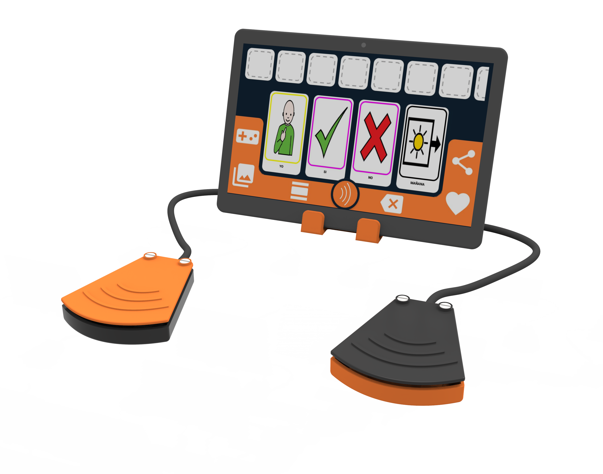

# Press And Press #

The Press & Press device imitates the functions of left and right clicking of a traditional PC mouse, which enables move on to the next element and select them with OTTAA Project's screen scan functionality. The device has been specifically designed for motor impaired people who have difficulties in their fine motor skills. It is compatible with Android, Windows, MacOS and Linux.

## Materials ##
•   High quality sound cable (50cm).

•   4 limit switches.

•   4mm x 4 self tapping screw.

•   Non-slip weatherstrip. D: 4mm, L: 230mm.

•   PCB Genius DX110/120.

•   OTG adapter.

•   Glue and silicone.

•   3D printed push button (3 parts x 2). Link: [A](https://github.com/aguszanoli/prueba/blob/9b890f3bed6f4917c54034c0f8aecce90f546e33/Build_Files/STL_Files/Button-V03-Base.STL), [B](https://github.com/aguszanoli/prueba/blob/9b890f3bed6f4917c54034c0f8aecce90f546e33/Build_Files/STL_Files/Button-V03-Skirt.STL), [C](https://github.com/aguszanoli/prueba/blob/9b890f3bed6f4917c54034c0f8aecce90f546e33/Build_Files/STL_Files/Button-V03-Top.STL).

•   3D printed lectern (2 parts). Link: [D](https://github.com/aguszanoli/prueba/blob/9b890f3bed6f4917c54034c0f8aecce90f546e33/Build_Files/STL_Files/Stand-V03-Case.STL), [E](https://github.com/aguszanoli/prueba/blob/9b890f3bed6f4917c54034c0f8aecce90f546e33/Build_Files/STL_Files/Stand-V03-Cover.STL).

## Open Source ##
We certify in [OSHWA Certification](https://certification.oshwa.org/).

The hardware is certified under a CERN license, and the documentation is under a CC BY-SA license.

The Press&Press OSHWA UID is [CL000004](https://certification.oshwa.org/cl000004.html).

